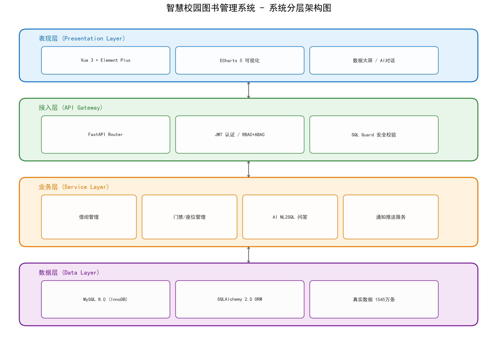
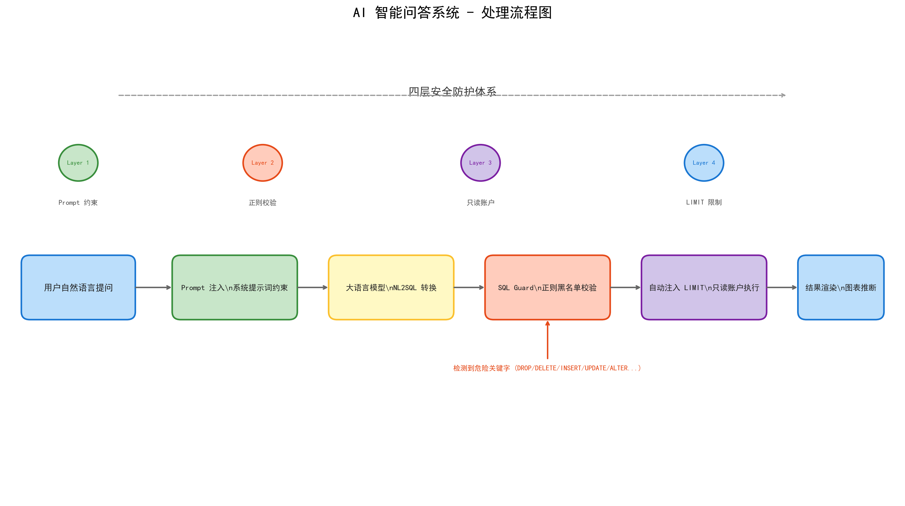
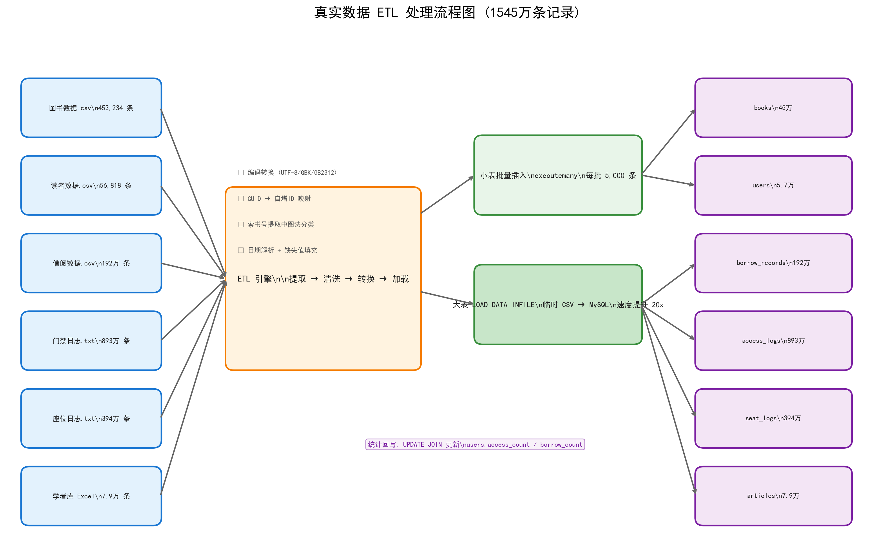
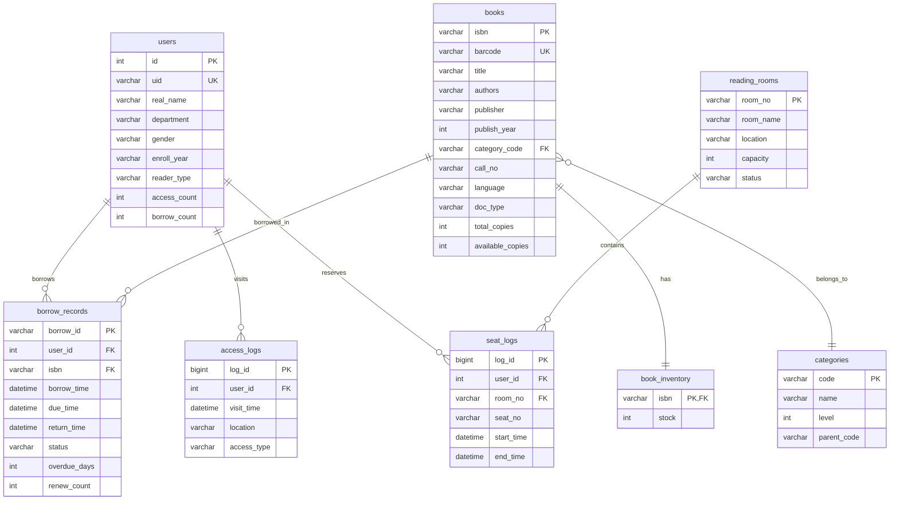

# 智慧校园图书借阅信息管理系统 V2.0

基于 Python + Vue3 的校园图书馆数据可视化与智能分析平台，支持千万级真实图书馆数据的存储、查询、可视化与 AI 自然语言问答。

## 项目简介

本项目是一个完整的高校图书馆信息化管理解决方案，涵盖图书编目、读者管理、借阅流通、门禁出入、座位预约等业务域。系统以某高校图书馆 2014-2024 年间的真实运营数据为基础（约 1,545 万条记录），构建了从数据预处理（ETL）、数据库设计、后端 API 到前端可视化大屏的完整技术链路。

## 技术栈

| 层级 | 技术选型 |
|------|---------|
| 后端框架 | FastAPI + SQLAlchemy 2.0 |
| 数据库 | MySQL 8.0 + pymysql |
| 前端框架 | Vue 3 + Vite + Element Plus |
| 可视化 | ECharts 5 |
| AI 问答 | 大语言模型 NL2SQL + SQL Guard 安全校验 |
| 数据预处理 | Python ETL + pandas + LOAD DATA INFILE |

## 项目结构

```
smart_library_fusion/
├── app/                          # 后端核心代码
│   ├── models.py                 # SQLAlchemy ORM 模型（13张表）
│   ├── database.py               # 数据库连接与会话管理
│   ├── services/
│   │   ├── ai_service.py         # AI 问答服务（NL2SQL）
│   │   ├── sql_guard.py          # SQL 安全防护（正则黑名单）
│   │   └── ...
│   └── main.py                   # FastAPI 主入口
├── frontend/                     # Vue3 前端
│   ├── src/
│   │   ├── components/           # 数据大屏、AI对话、高级分析组件
│   │   ├── App.vue
│   │   └── main.js
│   └── package.json
├── scripts/
│   └── etl_import_realdata.py    # 真实数据 ETL 导入脚本
├── schema.sql                    # MySQL 8.0 完整建表语句
├── app.py                        # 后端启动入口
├── 技术报告_V2.0.md               # 数据库期末作业技术报告
└── README.md                     # 本文件
```

## 数据规模

系统基于真实高校图书馆数据构建，各表记录数如下：

| 数据表 | 记录数 | 说明 |
|-------|-------|------|
| access_logs | 8,928,696 | 门禁出入日志（2014-2018，4年） |
| seat_logs | 3,941,001 | 座位预约日志（2014-2018，4年） |
| borrow_records | 1,929,135 | 图书借阅流水 |
| books | 453,234 | 图书编目信息 |
| users | 56,818 | 读者信息 |
| articles | 79,436 | 学者库论文（中英文） |
| **合计** | **~1,545万** | - |

## 快速开始

### 1. 环境准备

```bash
# 克隆仓库
git clone https://github.com/yourname/smart_library_fusion.git
cd smart_library_fusion

# 创建 Python 虚拟环境
python -m venv venv
venv\Scripts\activate  # Windows
# source venv/bin/activate  # Linux/Mac

# 安装后端依赖
pip install -r requirements.txt
```

### 2. 数据库初始化

```bash
# 登录 MySQL，执行建表语句
mysql -u root -p < schema.sql
```

### 3. 导入真实数据（ETL）

```bash
# 将 raw_data/ 目录下的真实数据清洗并导入数据库
python scripts/etl_import_realdata.py \
  --host localhost --user root --password your_password --database smart_library_v2
```

### 4. 启动后端

```bash
python app.py
# 默认运行在 http://localhost:8000
```

### 5. 启动前端

```bash
cd frontend
npm install
npm run dev
# 默认运行在 http://localhost:5173
```

## 核心功能

- **数据可视化大屏**：基础数据大屏 + 深度分析，含 19+ 种图表（折线、柱状、饼图、漏斗、热力图等）
- **AI 智能问答**：自然语言转 SQL，支持复杂分析查询（窗口函数、CTE、多表 JOIN）
- **SQL 查询优化**：覆盖索引、最左前缀、执行计划分析，慢查询从 97s 优化至 3s
- **安全机制**：四层 SQL 防护（Prompt 约束 + 正则黑名单 + 只读账户 + LIMIT 限制）

## 技术报告

详细的数据库设计、ETL 流程、SQL 优化案例与 AI 问答系统设计请参阅 `技术报告_V2.0.md`。


## 作者与贡献者

- **Leedl137** - 项目作者、数据库设计与后端开发
- **wangr9577@gmail.com** - 项目贡献者

## 系统架构图

### 分层架构



### AI 智能问答流程



### ETL 数据流



### 数据库 ER 图



## License

MIT License
